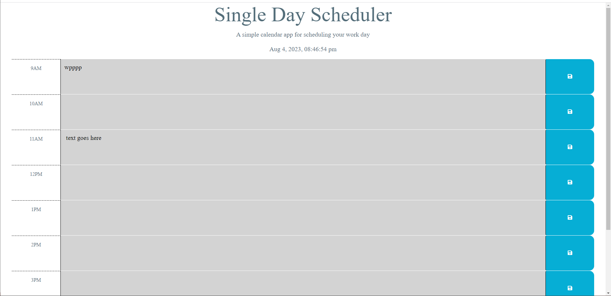

# Single Day Scheduler
Scheduler app to practice using DOM traversal and Dayjs. Live demo here 

# Introduction

*As a user I want to plan out my work day from 9AM to 5PM so that I can stay organized.

## Features

*shows current date and time in the header.
*Saves events in the text area to local storage.
*Highlights past events in grey, based on the currrent hour.
*Highlights current events in red, based on the currrent hour.
*Highlights future events in green, based on the currrent hour.

## Screenshot

## Future Features
*Add the ability to schedule by week and month
*Include virtual meeting links

# Citations
*GitHub for starter code https://github.com/coding-boot-camp/crispy-octo-meme
 